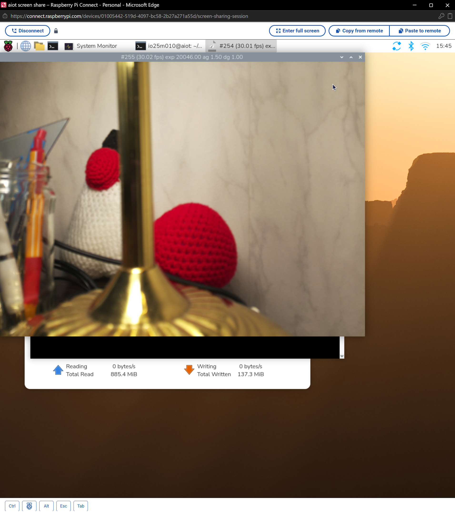
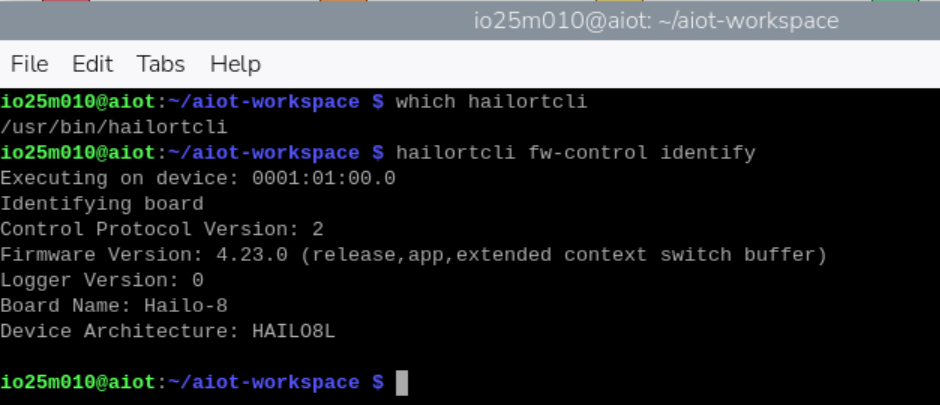
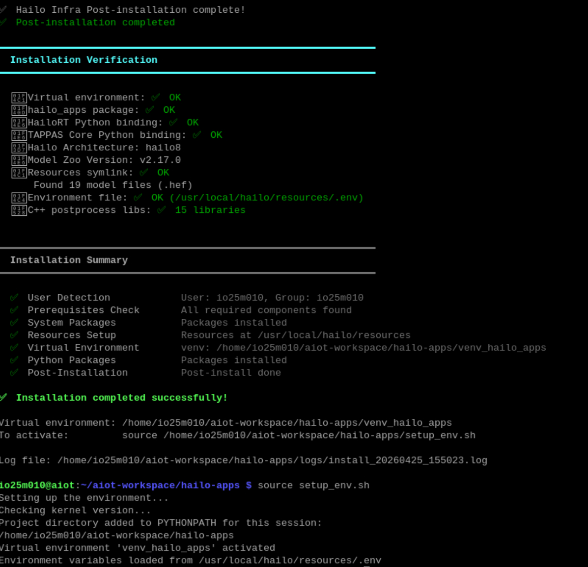
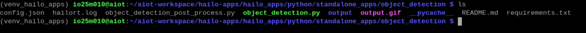
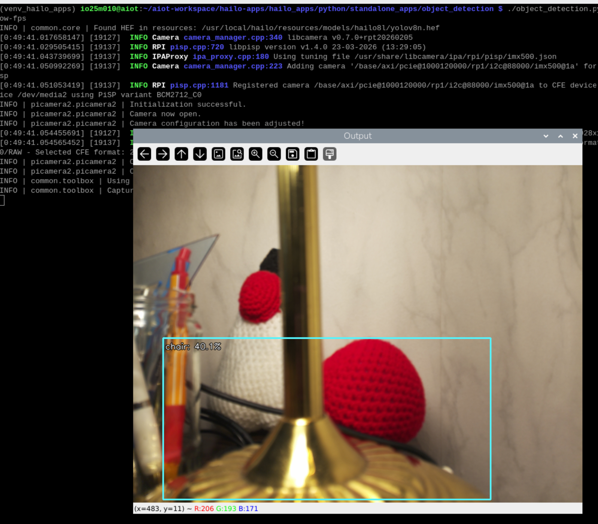
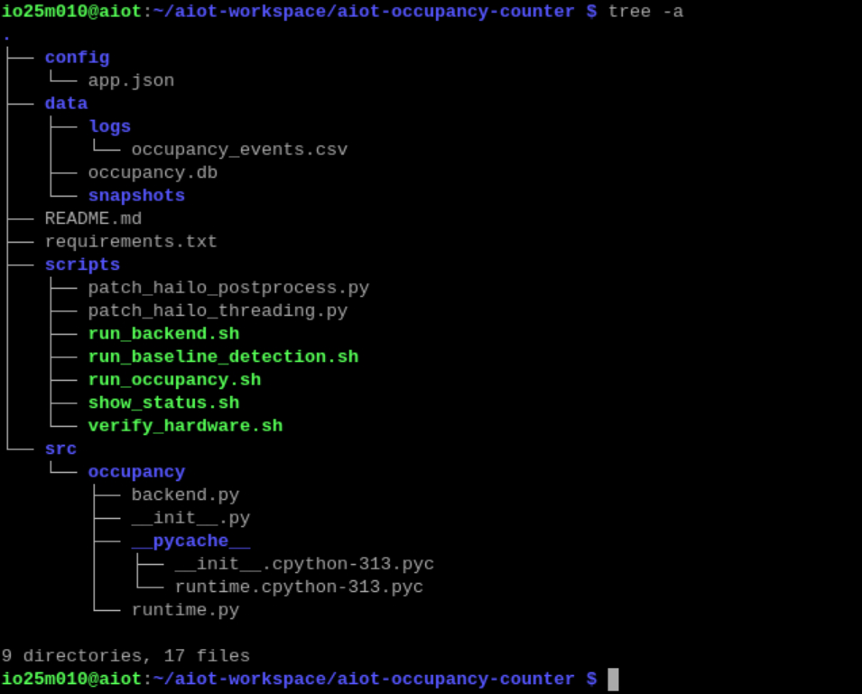
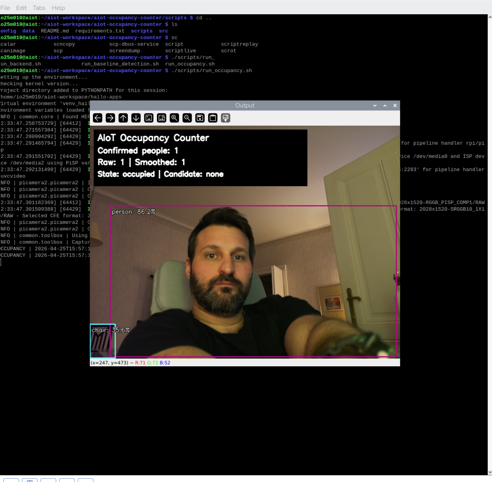
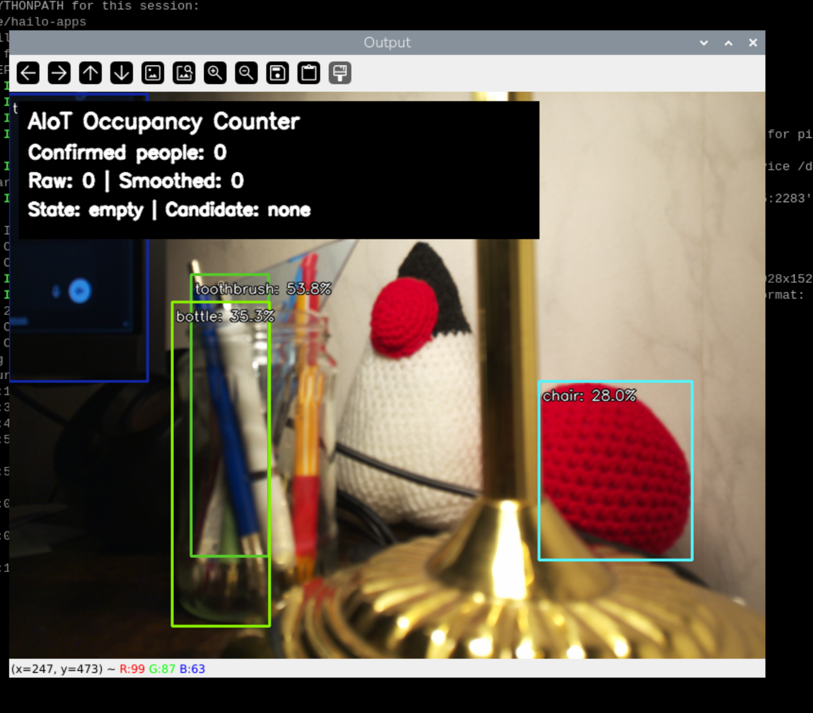
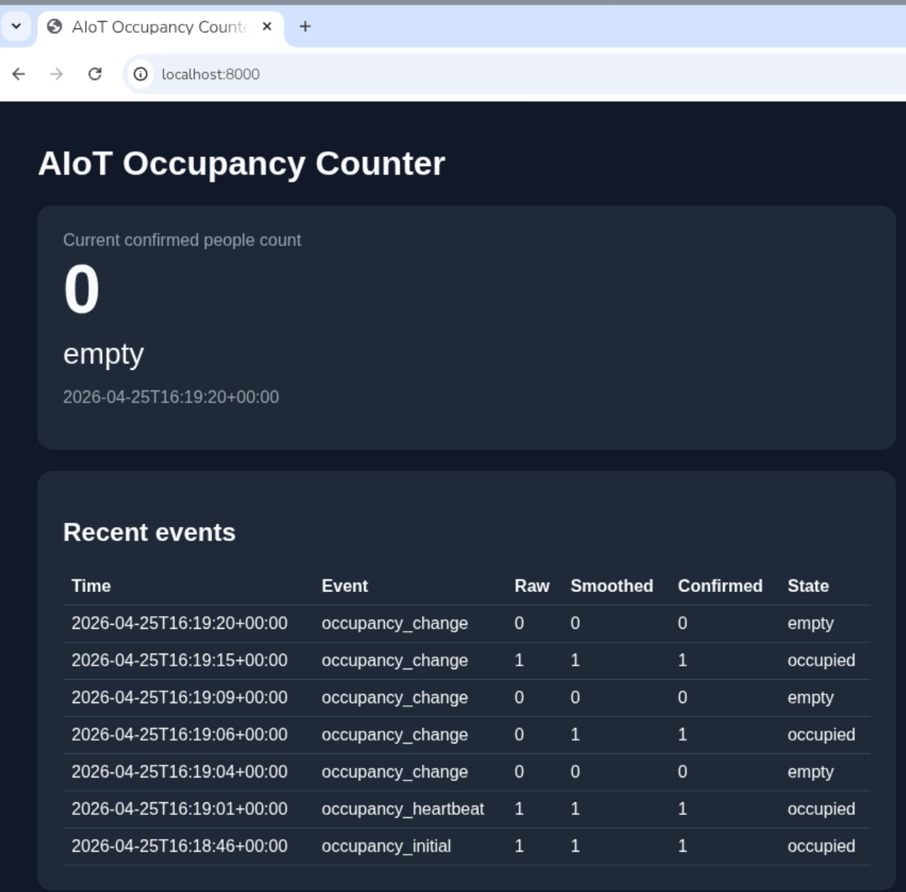
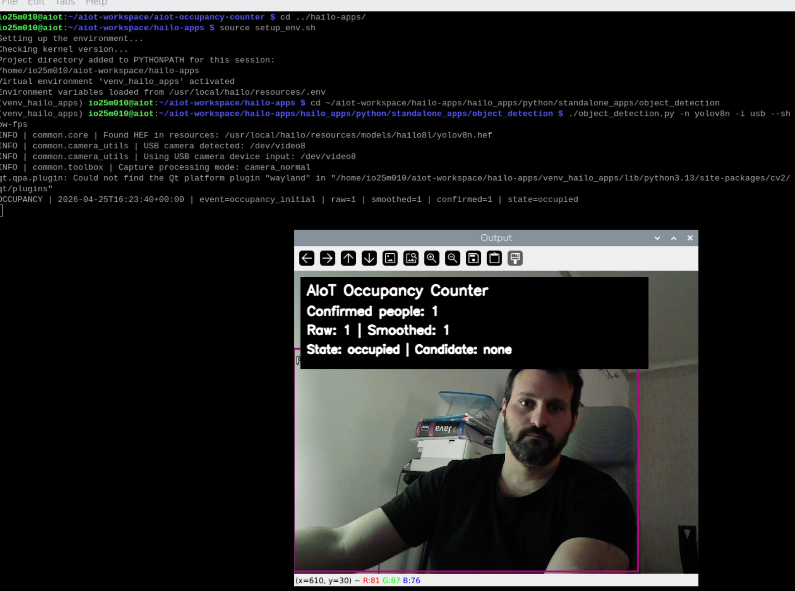

# AIoT Edge part - Occupancy Counter
## Get started 
To get started we need to download the `hailo-apps` from the official Github repo:
```sh
mkdir ~/aiot-workspace && cd ~/aiot-workspace
git clone https://github.com/hailo-ai/hailo-apps.git
```

Then we need to make sure we install some extra packages:
```sh
sudo apt update
sudo apt install -y git python3-venv python3-pip sqlite3 rpicam-apps
```

## Sanity check
To make sure the camera works we try this:
```sh
rpicam-hello -t 0
```
And here is the result:


After that we can go ahain and run the following to verify the `hailortcli`.
```sh
which hailortcli
hailortcli fw-control identify
```

Here is how it should look like:


## Focus on Hailo Apps 
In case something is wrong or not installed, make sure you install and run the setup.

```sh
cd ~/aiot-workspace/hailo-apps
sudo ./install.sh
source setup_env.sh

# if install.sh has already been executed then only run the following
source setup_env.sh 

```

Here is how it should look like:


## Run the baseline Object detection app
We can find the Object detection in the following folder: `/home/io25m010/aiot-workspace/hailo-apps/hailo_apps/python/standalone_apps/object_detection`

In there we have the following files:


### IMPORTANT
At the time of writing this document and `hailo-apps` v26.03.1, there was an error trying to run `object_detection.py` and it said clearly that the utility function was missing `threading` import. To solve that head to the following: `~/aiot-workspace/hailo-apps/hailo_apps/python/core/common` and find the file `camera_utils.py`. Go and paste this at the import section of the code `import threading` and then save and exit. 

Now back to the directory with the Object detection app (`aiot-workspace/hailo-apps/hailo_apps/python/standalone_apps/object_detection`), we simply run the file `object_detection.py` like so:
```sh
./object_detection.py -n yolov8n -i rpi --show-fps
```

Here is the outcome of this command:


___

# Initiate our Project
Below there is an image of the initial folder structure within the `aiot-occupancy-counter`. 


## IMPORTANT
Make sure to have already executed the `setup_env.sh` from within `~/aiot-workspace/hailo-apps` in order to activate the python environment. Only  then you can proceed with the next step.

## Install Packages
As you have seen earlier, we had within our project directory a file named `requirements.txt`. In there go ahead and add these:
```sh
pydantic
pyyaml
psutil
paho-mqtt
fastapi
uvicorn
```

And then from the Project Directory run the following:
```sh
pip install -r requirements.txt
```

## Implement the Occupancy Counter
At this point the baseline Hailo Object detection app works, now we need to implement our logic on top of it. 

Here is the idea:
```
Camera
  ↓
Hailo object detection
  ↓
Filter only person detections
  ↓
Count people
  ↓
Smooth the result
  ↓
Confirm state changes
  ↓
Write events to CSV + SQLite
  ↓
Expose current state through an API/dashboard

```

## Project Configuration
The main configuration file is
```sh
aiot-occupancy-counter/config/app.json
```

The configuration at the time of developing this was:
```json
{
  "site_id": "fh_technikum_aiot_lab",
  "camera_id": "rpi5_imx500_01",
  "person_class_id": 0,
  "person_class_name": "person",
  "confidence_threshold": 0.40,
  "smoothing_window": 15,
  "occupied_confirmation_seconds": 0.5,
  "empty_confirmation_seconds": 2.5,
  "count_change_confirmation_seconds": 1.2,
  "heartbeat_interval_seconds": 15.0,
  "csv_log_path": "data/logs/occupancy_events.csv",
  "sqlite_path": "data/occupancy.db",
  "draw_overlay": true
}
```

### Some simple explanations
- **confidence_threshold**: Minimum confidence required for a detection to count as a person
- **smoothing_window**: How many recent frames are used to smooth the people count
- **occupied_confirmation_seconds**: How long the system waits before confirming that the room became occupied
- **empty_confirmation_seconds**: How long the system waits before confirming that the room became empty
  - This is intentionally slower to prevent changing state when we have a missed detection
- **count_change_confirmation_seconds**: How long the system waits before confirming a change like
  - meant to wait before transitions (empty -> 1 person, 1 person -> 2 people, etc)
- **heartbeat_interval_seconds**: How often the system writes a status event even if nothing changed

## Apply the Project Patches
The Project does not reimplement the whole Hailo inference pipeline. Instead, we use the Hailo object detection app and we patch the post processing step. 

In practice this means:
- Hailo app handles:
  - camera input
  - model loading
  - inference
  - detection drawing
  - FPS display
- The Project handles
  - person counting
  - smoothing
  - occupancy state
  - CSV Logging
  - SQLite Logging
  - Dashboard/API

### Hook the occupancy code
```sh
python scripts/patch_hailo_postprocess.py ~/aiot-workspace/hailo-apps
```

### Run the Occupancy Counter
```sh
cd ~/aiot-workspace/aiot-occupancy-counter
./scripts/run_occupancy.sh
```

The script starts the Hailo object detection app with our occupancy logic enabled. 

**NOTE**: the script already runs the Hailo env setup so no need to do anything really. 

After running this is how it looks like:




### IMPORTANT
To make sure our scripts are ready to be executed, simply run this from the root directory:
```sh
chmod +x scripts/*.sh
```

## Check the Stored Events
The Project stores occupancy events in 2 places, `data/logs/occupancy_events.csv` and `data/occupancy.db`. 

Here is how we can check the logs:
```sh
cat data/logs/occupancy_events.csv
timestamp_utc,site_id,camera_id,event_type,raw_people_count,smoothed_people_count,confirmed_people_count,occupancy_state
2026-04-25T15:00:32+00:00,fh_technikum_aiot_lab,rpi5_imx500_01,occupancy_initial,0,0,0,empty
2026-04-25T15:00:52+00:00,fh_technikum_aiot_lab,rpi5_imx500_01,occupancy_heartbeat,0,0,0,empty
2026-04-25T15:00:56+00:00,fh_technikum_aiot_lab,rpi5_imx500_01,occupancy_change,1,1,1,occupied
2026-04-25T15:01:16+00:00,fh_technikum_aiot_lab,rpi5_imx500_01,occupancy_heartbeat,2,2,1,occupied
2026-04-25T15:01:17+00:00,fh_technikum_aiot_lab,rpi5_imx500_01,occupancy_change,2,2,2,occupied
2026-04-25T15:01:29+00:00,fh_technikum_aiot_lab,rpi5_imx500_01,occupancy_change,1,1,1,occupied
2026-04-25T15:01:41+00:00,fh_technikum_aiot_lab,rpi5_imx500_01,occupancy_change,0,0,0,empty
2026-04-25T15:06:36+00:00,fh_technikum_aiot_lab,rpi5_imx500_01,occupancy_initial,0,0,0,empty
2026-04-25T15:06:39+00:00,fh_technikum_aiot_lab,rpi5_imx500_01,occupancy_change,1,1,1,occupied
2026-04-25T15:06:51+00:00,fh_technikum_aiot_lab,rpi5_imx500_01,occupancy_change,1,0,0,empty
2026-04-25T15:06:53+00:00,fh_technikum_aiot_lab,rpi5_imx500_01,occupancy_change,1,1,1,occupied
2026-04-25T15:07:02+00:00,fh_technikum_aiot_lab,rpi5_imx500_01,occupancy_change,0,0,0,empty
2026-04-25T15:07:06+00:00,fh_technikum_aiot_lab,rpi5_imx500_01,occupancy_change,1,1,1,occupied
2026-04-25T15:07:12+00:00,fh_technikum_aiot_lab,rpi5_imx500_01,occupancy_change,2,2,2,occupied
2026-04-25T15:07:22+00:00,fh_technikum_aiot_lab,rpi5_imx500_01,occupancy_change,1,1,1,occupied
2026-04-25T15:07:33+00:00,fh_technikum_aiot_lab,rpi5_imx500_01,occupancy_change,0,0,0,empty
2026-04-25T15:07:53+00:00,fh_technikum_aiot_lab,rpi5_imx500_01,occupancy_heartbeat,0,0,0,empty
2026-04-25T15:08:13+00:00,fh_technikum_aiot_lab,rpi5_imx500_01,occupancy_heartbeat,0,0,0,empty
2026-04-25T15:08:33+00:00,fh_technikum_aiot_lab,rpi5_imx500_01,occupancy_heartbeat,0,0,0,empty
2026-04-25T15:08:53+00:00,fh_technikum_aiot_lab,rpi5_imx500_01,occupancy_heartbeat,0,0,0,empty
2026-04-25T15:09:13+00:00,fh_technikum_aiot_lab,rpi5_imx500_01,occupancy_heartbeat,0,0,0,empty
2026-04-25T15:10:29+00:00,fh_technikum_aiot_lab,rpi5_imx500_01,occupancy_initial,0,0,0,empty
2026-04-25T15:10:35+00:00,fh_technikum_aiot_lab,rpi5_imx500_01,occupancy_change,1,1,1,occupied
2026-04-25T15:10:40+00:00,fh_technikum_aiot_lab,rpi5_imx500_01,occupancy_change,0,0,0,empty
2026-04-25T15:10:43+00:00,fh_technikum_aiot_lab,rpi5_imx500_01,occupancy_change,1,1,1,occupied
2026-04-25T15:10:50+00:00,fh_technikum_aiot_lab,rpi5_imx500_01,occupancy_change,0,0,0,empty
2026-04-25T15:21:44+00:00,fh_technikum_aiot_lab,rpi5_imx500_01,occupancy_initial,0,0,0,empty
2026-04-25T15:21:49+00:00,fh_technikum_aiot_lab,rpi5_imx500_01,occupancy_change,1,1,1,occupied
```

And here is how we check the DB entries:
```sh
sqlite3 data/occupancy.db "select * from occupancy_events order by id desc limit 20;"
118|2026-04-25T16:00:33+00:00|fh_technikum_aiot_lab|rpi5_imx500_01|occupancy_heartbeat|0|0|0|empty
117|2026-04-25T16:00:18+00:00|fh_technikum_aiot_lab|rpi5_imx500_01|occupancy_heartbeat|0|0|0|empty
116|2026-04-25T16:00:03+00:00|fh_technikum_aiot_lab|rpi5_imx500_01|occupancy_heartbeat|0|0|0|empty
115|2026-04-25T15:59:48+00:00|fh_technikum_aiot_lab|rpi5_imx500_01|occupancy_heartbeat|0|0|0|empty
114|2026-04-25T15:59:33+00:00|fh_technikum_aiot_lab|rpi5_imx500_01|occupancy_heartbeat|0|0|0|empty
113|2026-04-25T15:59:18+00:00|fh_technikum_aiot_lab|rpi5_imx500_01|occupancy_heartbeat|0|0|0|empty
112|2026-04-25T15:59:03+00:00|fh_technikum_aiot_lab|rpi5_imx500_01|occupancy_heartbeat|0|0|0|empty
111|2026-04-25T15:58:48+00:00|fh_technikum_aiot_lab|rpi5_imx500_01|occupancy_heartbeat|0|0|0|empty
110|2026-04-25T15:58:33+00:00|fh_technikum_aiot_lab|rpi5_imx500_01|occupancy_heartbeat|0|0|0|empty
109|2026-04-25T15:58:18+00:00|fh_technikum_aiot_lab|rpi5_imx500_01|occupancy_change|0|0|0|empty
108|2026-04-25T15:58:07+00:00|fh_technikum_aiot_lab|rpi5_imx500_01|occupancy_change|2|1|1|occupied
107|2026-04-25T15:58:00+00:00|fh_technikum_aiot_lab|rpi5_imx500_01|occupancy_change|2|2|2|occupied
106|2026-04-25T15:57:55+00:00|fh_technikum_aiot_lab|rpi5_imx500_01|occupancy_change|2|1|1|occupied
105|2026-04-25T15:57:53+00:00|fh_technikum_aiot_lab|rpi5_imx500_01|occupancy_change|2|2|2|occupied
104|2026-04-25T15:57:49+00:00|fh_technikum_aiot_lab|rpi5_imx500_01|occupancy_heartbeat|1|1|1|occupied
103|2026-04-25T15:57:34+00:00|fh_technikum_aiot_lab|rpi5_imx500_01|occupancy_heartbeat|1|1|1|occupied
102|2026-04-25T15:57:19+00:00|fh_technikum_aiot_lab|rpi5_imx500_01|occupancy_initial|1|1|1|occupied
101|2026-04-25T15:39:59+00:00|fh_technikum_aiot_lab|rpi5_imx500_01|occupancy_heartbeat|0|0|0|empty
100|2026-04-25T15:39:44+00:00|fh_technikum_aiot_lab|rpi5_imx500_01|occupancy_heartbeat|0|0|0|empty
99|2026-04-25T15:39:29+00:00|fh_technikum_aiot_lab|rpi5_imx500_01|occupancy_heartbeat|0|0|0|empty
```

**NOTE**: there is a helper script to reach the DB, just run `./scripts/show_status.sh`.

## Run the Backend and the Dashboard
The Project includes a small FastAPI backend. To run it run th escript as seen below.
```sh
cd ~/aiot-workspace/aiot-occupancy-counter
./scripts/run_backend.sh
```

The Backend reads the SQLite DB and exposes current occupancy state.

### API Endpoints
- GET /health
- GET /current
- GET /events
- GET /summary
- GET /

### Test the API 
If you want to test the API here are some curl commands
```sh
curl http://127.0.0.1:8000/health
curl http://127.0.0.1:8000/current
curl http://127.0.0.1:8000/events?limit=5
curl http://127.0.0.1:8000/summary
```

### Open the Dashboard
from RPI
```sh
http://127.0.0.1/8000
```

Or from the same network:
```sh
http://<rpi-ip>/8000
```

This is how it looks like:



## Clean test run
In case you have used it already and want to clean the data here is a simple way. 
```sh
cd ~/aiot-workspace/aiot-occupancy-counter
rm -f data/occupancy.db
rm -f data/logs/occupancy_events.csv
```

then run the project again
```sh
./scripts/run_occupancy.sh
```
___
# Extra Section
## Run with USB webcam
The current default uses the RPI camera
```sh
./object_detection.py -n yolov8n -i rpi --show-fps
```
A normal USB webcam can also work. 
```sh
sudo apt install -y v4l-utils
v4l2-ctl --list-devices
ls /dev/video*
```

Then test the webcam with the baseline Hailo app:
```sh
cd ~/aiot-workspace/hailo-apps
source setup_env.sh

cd ~/aiot-workspace/hailo-apps/hailo_apps/python/standalone_apps/object_detection

./object_detection.py -n yolov8n -i usb --show-fps
```

or select a specific device:
```sh
./object_detection.py -n yolov8n -i /dev/video0 --show-fps
```
For the authors case it seems that it works perfect just by adding the `-i usb` flag.

